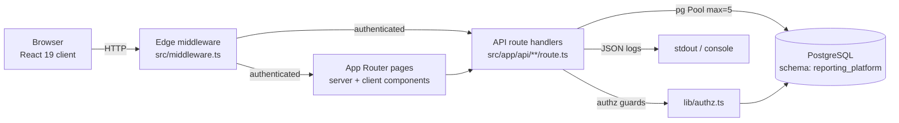
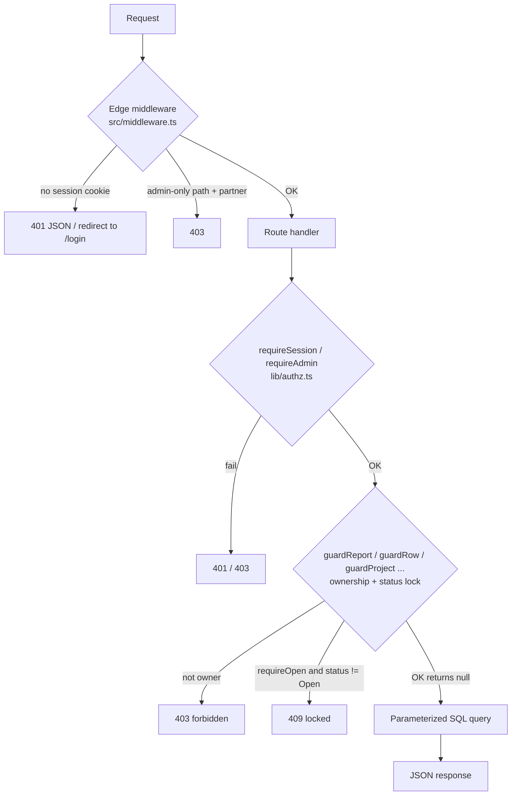
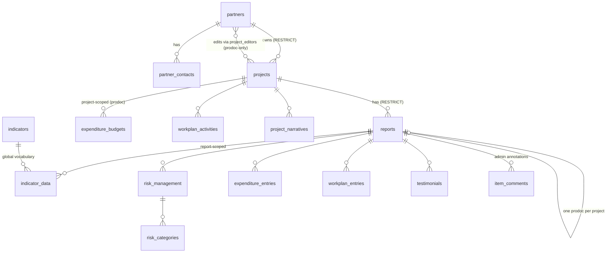

# PRISM — CRAF'd Reporting Platform · Technical Onboarding
---

## Table of contents

1. [Platform overview](#1-platform-overview)
2. [Architecture](#2-architecture)
3. [Repository and file structure](#3-repository-and-file-structure)
4. [Codebase: modules, patterns, extension points](#4-codebase-modules-patterns-extension-points)
5. [Libraries and dependencies](#5-libraries-and-dependencies)
6. [Data and persistence](#6-data-and-persistence)
7. [Configuration and environments](#7-configuration-and-environments)
8. [Build, runtime, and deployment](#8-build-runtime-and-deployment)
9. [Testing](#9-testing)
10. [Observability and debugging](#10-observability-and-debugging)
11. [Security](#11-security)
12. [Common risks and pitfalls](#12-common-risks-and-pitfalls)
13. [Engineering workflow](#13-engineering-workflow)
14. [Known technical debt and architectural concerns](#14-known-technical-debt-and-architectural-concerns)
15. [Quick reference](#15-quick-reference)
16. [The 15 most important things to understand](#16-the-15-most-important-things-to-understand)

---

## 1. Platform overview

**What it does.** PRISM is a reporting web application for the CRAF'd (Complex
Risk Analytics Fund) portfolio. Partner organizations submit narrative and
quantitative project reporting — achievements, indicators, work plans, budgets,
risk registers, testimonials, surveys, complementary funding, transfers — and
the CRAF'd Secretariat (the single "admin" account) reviews, comments on,
authorizes, and exports it. There is also an aggregate dashboard and a
partner-facing wiki/guide. (`README.md:1-10`)

**Package name.** `prism` (`package.json:2`). The user-facing name is "PRISM —
CRAF'd Reporting Platform".

**Major responsibilities.**

- **Project documents (ProDocs).** Every project has exactly one project
  document — a `reports` row with `data_type='prodoc'` — that defines the project
  (narratives, SDG targets, baseline workplan, approved budgets, signatures).
- **Annual/final reports.** Zero-or-more `reports` rows with `data_type='report'`
  per project, each carrying that year's actuals against the ProDoc baseline.
- **Review workflow.** A status lifecycle (`Open → Under Review → Closed`) that
  moves editing control between partner and Secretariat.
- **Export.** Admin-only ZIP export of CSVs plus embedded binary files (uploaded
  documents, testimonial photos), and per-report PDF generation.
- **Admin configurability.** UI labels and dropdown option lists are editable
  live from the Settings page without a redeploy.

**Design principles that shape everything.**

- **The database is the only datastore.** No real reporting data lives in the
  repo; it is entirely in PostgreSQL and read/written at runtime. Even uploaded
  files and photos are stored inline as `bytea` in the DB — there is no blob
  store or object storage. (`README.md:123-129`, `download/zip/route.ts:466-508`)
- **Server is the trust boundary.** The client (localStorage user, the client
  auth guard, the rich-text editor) is cosmetic/UX only. All authorization and
  input sanitization happen server-side. (`api/auth/login/route.ts:10-12`,
  `src/lib/sanitize.ts:8-11`)
- **Single sources of truth.** Recurring lists (section registry, report child
  tables, labels, options, status badge colours) are each centralized in one
  module so parallel consumers cannot drift. This is a deliberate reaction to
  past drift (see `report-tables.ts:5-8`).
- **Least privilege end to end.** The app connects to Postgres as a DML-only
  role; DDL is never run at runtime. (`src/lib/db.ts:11-15`)

---

## 2. Architecture

### 2.1 Runtime shape

This is a **single Next.js 16 App Router application** (React 19, TypeScript).
There is no separate backend service — API routes and pages are the same
deployable. PostgreSQL (hosted on Azure Database for PostgreSQL Flexible Server,
per the connection defaults) is the only external dependency at runtime.



### 2.2 Three-layer authorization

Security is enforced in three cooperating layers. This is the single most
important mental model for the codebase.



1. **Edge middleware** (`src/middleware.ts`) — the coarse choke point. Runs on
   every `/api/*`, `/admin/*`, `/partner/*` request (`middleware.ts:70-72`).
   Rejects unauthenticated requests before any handler runs (API → 401 JSON,
   page → redirect). Enforces admin-only *paths* (`/api/download`, `/api/upload`,
   `/api/reports/activity`; `middleware.ts:22`) and admin-only *pages*
   (`/admin/*`).
2. **Session verification** (`src/lib/session.ts`) — the source of truth for
   identity. An HMAC-SHA256-signed, httpOnly cookie `crafd_session` carrying
   `{ role, org, partner_id, name, exp }`. Implemented with the **Web Crypto
   API** (not Node `crypto`) precisely so the *same* verify path runs on the Edge
   (middleware) and in Node route handlers. (`session.ts:6-8`)
3. **Per-route authorization** (`src/lib/authz.ts`) — fine-grained role checks,
   ownership/IDOR enforcement, and report-status locking, run inside handlers as
   defense-in-depth. **Admins bypass all ownership and status checks.**

### 2.3 Roles and ownership model

Two roles only: `admin | partner` (`session.ts:24`).

- **admin** — a single shared "CRAF'd Secretariat" account (not a DB user).
  `org=null`, `partner_id=null`. Sees and can edit everything; never
  status-locked.
- **partner** — a row in `partners`, identified for ownership by `short_name`
  (carried as `session.org`) and `partner_id`.
- **project_editors** — *not* a role. A grant table `(partner_id, project_id)`
  that gives an "implementing partner" **ProDoc-only** edit rights on *another*
  partner's project. Editors are matched by `partner_id`; owners by `short_name`.
  Editor access to a `reports` row is allowed **only** when
  `data_type='prodoc'`. (`authz.ts:90-110`)

Ownership is a set of SQL predicates in `authz.ts` that join the target row back
through `reports → projects → partners` (report-scoped),
`projects → partners` (project-scoped), or directly to `partners`
(partner-scoped), matching `lower(short_name) = lower(org)`, `UNION`'d with the
`project_editors` path. The public guards return `null` when access is allowed or
a `NextResponse` (403/409) to return.

### 2.4 The status lock — the core control-flow gate

`reports.status` is a `TEXT` column with the lifecycle **`Open → Under Review →
Closed`** (`authz.ts:112-118`, schema.sql header). Editability:

| Status        | Partner | Admin |
|---------------|:-------:|:-----:|
| Open          | edit    | edit  |
| Under Review  | read    | edit  |
| Closed        | read    | read  |

- **Server enforcement:** write guards take `{ requireOpen: true }`. When set and
  the report is not `Open`, the guard returns **409 "This report is not open for
  editing"** (`authz.ts:31-36, 268-271`). Every mutating partner-reachable route
  must pass this option.
- **UI enforcement (mirror):** `readOnly` is computed once in the editor
  (`report-editor.tsx:844-848`) and applied via a `<fieldset disabled>` plus a
  `ReadOnlyProvider` context (because Radix Select/Dropdown triggers are
  portalled and escape the fieldset cascade — see §4.5).

The server lock is the real one; the UI lock is UX. Never rely on the UI alone.

### 2.5 End-to-end flow example: a partner edits a risk row

1. Partner navigates to `/partner/report-editor/<project>/<year>/risk`.
   Middleware verifies the `crafd_session` cookie (`middleware.ts:62-65`).
2. `ReportEditor` (client) loads the report and its risk rows via
   `/api/risk?reportId=...`. `guardReport` confirms the partner owns the report.
3. Partner edits a cell. Because `risk` is a **parent-managed section** (§4.4),
   the edit updates parent state, marks the row `dirty`, pushes an undo command,
   and schedules autosave (`report-editor.tsx:410, 774-797`).
4. After a 700 ms debounce, `flushParent` PATCHes only the dirty rows to
   `/api/risk`. That route calls
   `guardRow(session, "risk_management", id, { requireOpen: true })`
   (`authz.ts:299`). If the report is `Under Review`/`Closed`, the partner gets a
   409 and nothing is written.
5. On success the `dirty` flag clears only if the content is unchanged since a
   JSON snapshot taken before the request — so edits made during the round-trip
   survive (`report-editor.tsx:374-389`).

### 2.6 End-to-end flow example: creating the annual report batch (admin)

`POST /api/reports` with `{ year, annual: true }` (`reports/route.ts:340`,
admin-only). In one DB transaction it inserts one `reports` row per project
(`INSERT … SELECT … ON CONFLICT (project_id, year, data_type) DO NOTHING`) and
then runs four **set-based** seeders over the new report ids so single and batch
creation share code:

- `copyProdocBaseline` — copies the risk register and indicator baseline/target
  lines from each project's ProDoc (`reports/route.ts:159`).
- `seedReportSurveys` — copies the prior year's survey questions, else pulls
  `standard_survey_questions` by `report_type` (`:201`).
- `populateExpenditureEntries` — one entry row per `expenditure_categories`;
  `approved_amount` is a GENERATED column so it needs no value (`:261`).
- `seedWorkplanUpdateWindows` — idempotently creates and activates the workplan
  update window, respecting the one-active-window-per-project partial unique
  index (`:292`).

ProDocs cannot be created here — they are auto-created with the project. (inference: exact project-creation path not fully traced; **Requires Confirmation** for the precise trigger.)

### 2.7 Async vs sync workflows

There is **no queue, no background worker, no message bus, no cron** in the
repository. All work is synchronous within the request:

- Autosave is a **client-side** debounce (700 ms) that fires ordinary PATCH
  requests (`autosave.tsx:23`).
- ZIP export and PDF generation run synchronously inside the request handler and
  stream the result back.

**(inference)** Large exports could be slow/heavy because they load binary blobs
from the DB into memory and zip them in-process — see §12.

---

## 3. Repository and file structure

```
crafd-reporting-platform/
├── src/
│   ├── middleware.ts            # Edge auth choke point (the app's front door)
│   ├── app/                     # Next.js App Router
│   │   ├── layout.tsx           # Root layout (server) — injects label/option overrides
│   │   ├── page.tsx             # "/" — client redirect by role
│   │   ├── error.tsx            # Route error boundary
│   │   ├── global-error.tsx     # Root-layout error boundary
│   │   ├── login/               # The only unauthenticated page
│   │   ├── m/[token]/           # Magic/share-link landing page
│   │   ├── admin/               # Secretariat UI (layout requires role=admin)
│   │   ├── partner/             # Partner UI + wiki (layout requires a session)
│   │   ├── prodoc-print/[id]/   # Printable ProDoc (client html2canvas → PDF)
│   │   └── api/                 # 55 route.ts files (~40 folders) — the backend
│   ├── components/
│   │   ├── ui/                  # shadcn/ui wrappers over Radix + Tailwind
│   │   ├── report-editor/       # The report editor + its sections
│   │   ├── admin/               # Admin-only editors (prodoc, labels, options, ...)
│   │   └── *.tsx                # sidebar, autosave, grids, etc.
│   └── lib/                     # Data access, auth, domain logic, labels/options
├── db/
│   ├── schema.sql               # CANONICAL, idempotent full schema (1187 lines)
│   ├── roles.sql                # Creates least-privilege prism_app role
│   ├── add-*.sql                # A few forward migrations for drifted live DBs
│   └── archive/                 # NON-REPLAYABLE legacy migration history
├── public/                      # fonts, images (SDG icons), logos
├── package.json, next.config.ts, tsconfig.json, eslint.config.mjs,
│   tailwind.config.ts, postcss.config.mjs, components.json, globals.css
├── .env                         # LOCAL dev env (git-ignored) — contains live-ish creds
├── README.md                    # Setup + DB provisioning (read this first)
└── EXPENDITURE_*.md, SCHEMA_IMPROVEMENTS.md, PROJECT_DATE_CALCULATION_STANDARD.md
                                  # Design notes / historical proposals
```

**Where new functionality generally goes.**

- **A new "list under a report" section** (repeated rows with text columns +
  `links` + `sort_order`): add a table to `schema.sql`, add it to
  `REPORT_SCOPED_TABLES` (`lib/report-tables.ts`), create
  `src/app/api/<section>/route.ts` using `makeSectionRoute(...)`
  (`lib/section-route.ts`), register it in `lib/report-sections.ts`, and render it
  via `SectionTableEditor` in the editor. This is the low-friction path.
- **A new bespoke section** (custom grid/logic): new `route.ts` with the standard
  handler shape + guards, a new component, add to the section registry and the
  editor's dispatch conditional (`report-editor.tsx:1105-1251`).
- **A new dropdown's allowed values**: `src/lib/options.json` (+ read via
  `lib/options.ts`), editable at runtime through Settings.
- **New user-facing copy**: `src/lib/labels.json` (read via `lib/labels.ts`),
  runtime-overridable.
- **A schema change**: edit `db/schema.sql` (canonical) *and* provide a small
  forward migration under `db/` for existing databases; re-run `db/roles.sql` to
  grant the new objects. Never edit `db/archive/`.

**Non-obvious organization to know about.**

- `src/lib/reports.ts` is **UI-only** (status badge colours) despite the name —
  it holds no report data logic (`reports.ts:1-8`).
- `src/lib/indicators.ts`, `risk.ts`, `workplan.ts`, `expenditure.ts` are mostly
  label/color/math helpers; the *routes* under `src/app/api/` hold the data logic.
- `report-sections.ts` and `report-tables.ts` are two different registries:
  the former is UI section metadata (order, labels, groups); the latter is the
  canonical set of DB child tables.
- `db/archive/` contains two *separate*, colliding legacy migration chains
  (`db-incremental/` and `migrations/`) that are **not replayable**. Do not read
  them to understand the current schema — read `schema.sql`.
- There is a stray `uv.lock` (Python) at the root with no `pyproject.toml` or
  `.py` files — **Unknown** why it exists; appears unused by the app.

---

## 4. Codebase: modules, patterns, extension points

### 4.1 The standard API route handler shape

Every handler follows this skeleton (canonical form:
`api/reports/[id]/route.ts:11-42`):

```ts
export async function GET(_req, { params }: { params: Promise<{ id: string }> }) {
  const { id } = await params;                    // params is a Promise (Next 15+)
  const session = await requireSession();         // 1. authn
  if (session instanceof NextResponse) return session;
  const gate = await guardReport(session, id);    // 2. authz / ownership (+ requireOpen on writes)
  if (gate) return gate;
  try {
    const rows = await query(`SELECT ...`, [id]); // 3. parameterized SQL
    if (rows.length === 0) return NextResponse.json({ error: "..." }, { status: 404 });
    return NextResponse.json(rows[0]);            // 4. JSON
  } catch (err) {
    logger.error("GET /api/reports/[id] error:", err);
    return NextResponse.json({ error: "Failed to fetch report" }, { status: 500 });
  }
}
```

Contracts to copy exactly:

- `requireSession` / `requireAdmin` return `Session | NextResponse` → check
  `if (x instanceof NextResponse) return x`.
- `guardReport` / `guardRow` / `guardProject` / … return `NextResponse | null` →
  check `if (gate) return gate`.
- **All SQL is parameterized** (`$1, $2, …`). The *only* thing ever interpolated
  into SQL text is a **table name**, and only after passing the
  `IDENT = /^[a-z_][a-z0-9_]*$/` allowlist (`authz.ts:18`, `section-route.ts:31`).
  Table names come from server config, never from user input.
- Errors are logged with the real detail and returned to the client as a fixed
  generic message + 500 — internals never leak (`lib/http.ts:38-44`).
- Multi-statement writes use an explicit transaction via `pool.connect()` →
  `BEGIN`/`COMMIT`/`ROLLBACK` in `try/finally` with `client.release()`
  (e.g. `reports/route.ts:383-455`).

`src/lib/http.ts` centralizes response envelopes and coercion (`parseBody`,
`badRequest`, `notFound`, `serverError`, `deleted`, `toNumber`, `toIntId`).
**Adoption is partial** — several routes still hand-roll these shapes; prefer the
helpers in new code.

### 4.2 `makeSectionRoute` — the CRUD factory

`lib/section-route.ts` exports `makeSectionRoute({ table, fields, max? })` →
`{ GET, POST, PATCH, DELETE }` for the repeated "list under a report" sections
(key achievements, partnerships, results, lessons learned, external coverage). It
validates identifiers, enforces `requireSession` + `guardReport`/`guardRow` (with
`{ requireOpen: true }` on writes), auto-manages `sort_order`, and enforces a
per-report cap. This is the extension point for new list sections.

### 4.3 The `lib/` domain modules

| Module | Responsibility |
|---|---|
| `db.ts` | Single `pg.Pool` (`max: 5`), TLS `rejectUnauthorized: true`, DATE→string type parser (avoids TZ day-shift). Exports `query<T>(text, params)` and the pool. |
| `session.ts` | Mint/verify the signed session cookie (Web Crypto). |
| `authz.ts` | Session gates, ownership predicates, status-lock guards. |
| `http.ts` | Response envelopes + value coercion. |
| `logger.ts` | Structured JSON logger with a Sentry-ready `reportError` hook. |
| `sanitize.ts` | Server-side rich-text sanitizer (write-side trust boundary). |
| `richtext.ts` | Isomorphic read/render-side rich-text helpers. |
| `labels.ts` / `options.ts` | Runtime-overridable UI copy / dropdown values. |
| `report-tables.ts` | Canonical report/prodoc child-table lists. |
| `report-sections.ts` | Canonical UI section registry + `parseReportPath`. |
| `risk.ts` | 5×5 risk matrix, label↔number conversion (used by CSV import). |
| `expenditure.ts` | Pure budget/variance math. |
| `workplan.ts` | Quarter-key math + status metadata. |
| `indicators.ts` | Indicator status/cycle labels + colors. |

### 4.4 Report editor: the two section patterns

The report editor (`src/components/report-editor/report-editor.tsx`, ~1260 lines,
one client component shared by admin and partner) dispatches sections in a large
conditional (`:1105-1251`). There are **two patterns**, named in the code at
`:855-859`:

- **Pattern A — parent-managed presentational** (`surveys`, `overview`, `risk`,
  `indicators`): the parent owns all state and CRUD; the section is a pure
  presentational component receiving ~20 props. These drive the parent's autosave
  (`flushParent`, `:341-390`), which saves only `dirty` items.
- **Pattern B — self-managing children** (`transfers`, `complementary`,
  `testimonials`, the `SectionTableEditor` list sections, `workplan`,
  `expenditure`): each fetches/saves its own data and only reports save state
  upward via `onSaveStateChange={setChildSaveState}`.

The top bar shows whichever owner is active:
`const displaySaveState = parentManaged ? parentAutosave.state : childSaveState`.

When adding a section, pick a pattern and follow it — mixing them is the most
common source of autosave bugs.

**Undo/redo** is a command stack (`HistoryCommand { undo, redo }`), capped at
100, with deletes whose `undo` re-creates the row server-side. Ctrl/Cmd+Z /
Shift+Z / Ctrl+Y are wired globally; history resets on section/report change.

### 4.5 Read-only enforcement in the UI

`readOnly` (§2.4) is applied two ways together (`report-editor.tsx:1080-1093`):

1. `<fieldset disabled={readOnly}>` — natively disables native controls.
2. `<ReadOnlyProvider readOnly={readOnly}>` — because **Radix Select and
   DropdownMenu triggers are portalled out of the DOM subtree** and escape the
   fieldset cascade (a Chromium/WebKit quirk). Those wrappers read the context and
   disable themselves (`ui/select.tsx:16-17`, `ui/dropdown-menu.tsx:22`,
   `ui/rich-text-editor.tsx:63-64`).

So there is **no per-control `readOnly` threading** — new interactive controls
that portal must consume `useReadOnly()`.

### 4.6 Labels & options: live overrides

`labels.json` / `options.json` are compiled-in defaults. Admin overrides are
stored as JSON blobs in `app_settings`, read during the **root layout** render
(`app/layout.tsx`), merged into a shared server singleton **in place**, and
injected into the initial HTML as `window.__LABEL_OVERRIDES__` /
`window.__OPTION_OVERRIDES__` so the client patches its copy *before hydration*
(no mismatch). Consequences for engineers:

- **Import `@/lib/labels` / `@/lib/options`, never the raw `.json`** — otherwise
  you snapshot the defaults and miss overrides.
- The merge mutates existing objects/arrays *in place* so module-scope captures
  (`const g = labels.generalInfo`) stay live.
- **API routes do not render the root layout.** Any route that validates an
  incoming value against option lists must first call
  `applyOptionOverrides(await getOptionOverrides())` (`options.ts:16-19`).
- The root layout is `export const dynamic = "force-dynamic"` so overrides are
  never baked into a static prerender (`layout.tsx:31`).

---

## 5. Libraries and dependencies

Core (load-bearing):

| Dependency | Version (semver in package.json) | Why / how |
|---|---|---|
| `next` | ^16.3.0 | The whole framework — App Router, Edge middleware, route handlers. Requires Node 20.9+. `next lint` was removed in 16, so linting runs via the `eslint` binary. |
| `react` / `react-dom` | ^19.1.0 | UI. Note `params` in route handlers is now a `Promise`. |
| `pg` | ^8.21.0 | PostgreSQL driver. Single `Pool` in `lib/db.ts`. DATE type parser override. |
| `sanitize-html` | ^2.17.6 | **Server-side** write-side HTML sanitizer (`lib/sanitize.ts`). The real XSS trust boundary. |
| `dompurify` | ^3.4.13 | **Client-side** read/render sanitization (`lib/richtext.ts`); no-op on the server (needs `window`). |
| `fflate` | ^0.8.3 | In-process ZIP building for the admin export (`download/zip`). |
| `jspdf` | ^4.2.1 | Server-side per-report PDF generation (`api/reports/[id]/pdf`). |
| `html2canvas` | ^1.4.1 | Client-side ProDoc print → canvas → PDF (`app/prodoc-print/[id]`). |
| `recharts` | ^2.15.3 | Dashboard charts. |
| Radix UI (`@radix-ui/*`) | various | Accessible primitives behind `components/ui/*`. |
| `tailwindcss` (v4) + `@tailwindcss/postcss` | ^4.1.0 | Styling. **CSS-first config** — theme lives in `globals.css`; `tailwind.config.ts` only disables shadow plugins. |
| `class-variance-authority`, `clsx`, `tailwind-merge` | — | The `cn()` class-composition utility. |
| `lucide-react` | ^0.513.0 | Icons (wiki section icons are validated against an allowlist). |

Incidental / dev: `@types/*`, `eslint` 9 + `eslint-config-next` 16 (flat config;
react-hooks v6 rules demoted to warnings — see `eslint.config.mjs:16-37`),
`tw-animate-css`.

**Notable: password hashing uses Node's built-in `scrypt`** (`lib/password.ts`) —
no external crypto dependency.

**Version-specific behaviour to remember:**

- Next 16 route `params` is a `Promise` — always `await params`.
- Next 16 removed `next lint`; use `npm run lint` (bare eslint).
- The react-hooks v6 rules are set to **warn**, not error, because ~60 existing
  patterns in the autosave grids trip them; the baseline is intentionally
  "green with warnings" (`eslint.config.mjs:16-37`).

---

## 6. Data and persistence

### 6.1 Database

PostgreSQL. All objects live in a single schema, **`reporting_platform`**
(`schema.sql:21-22`); the app fully-qualifies every table. Connection defaults
point at Azure Database for PostgreSQL Flexible Server.

**Canonical schema:** `db/schema.sql` is a single **idempotent** file
(`IF NOT EXISTS` / `OR REPLACE` / `DROP TRIGGER` guards) that reproduces the exact
current schema on a fresh DB. It — not the archived migration chains — is the
source of truth.

### 6.2 Entity model (high level)



**Core entities.**

- `partners` — org + login. Case-insensitive unique on `lower(short_name)`.
  `password_hash` in `scrypt:salt:hash` format; `mail_account` unique/optional.
- `projects` — owned by one partner (FK `RESTRICT`). Start date +
  `project_duration_months` are the single source of truth for the timeline
  (there is deliberately no stored end date). `indirect_cost_rate` default 0.07.
- `reports` — the central hub. `UNIQUE (project_id, year, data_type)` and a
  **partial unique index** enforcing exactly one `prodoc` per project. `status`
  and `report_type` are free `TEXT` (admin-editable option values). `authorized`
  is a separate submit boolean.
- Report-scoped children (13 tables, all `CASCADE` on report delete): see
  `report-tables.ts`.
- ProDoc project-scoped tables (5): narratives, SDG targets, signatures, baseline
  workplan, approved budgets.
- Global libraries (unscoped): `indicators`, `expenditure_categories`,
  `standard_survey_questions`, `standard_narrative_questions`, `wiki_sections`,
  `app_settings`.

**FK delete behaviour:** `projects.partner_id` and `reports.project_id` are
`RESTRICT` (can't delete a partner with projects or a project with reports); most
children `CASCADE`; provenance links (`workplan_entries.report_id`,
`transfer_data.linked_activity_id`) are `SET NULL`.

### 6.3 Triggers, functions, generated columns

- `set_updated_at()` — trigger function on nearly every table keeping
  `updated_at` current on UPDATE (`schema.sql:60-66`).
- `project_year_range(start, months) → int[]` and
  `project_end_date(start, months) → date` — IMMUTABLE SQL functions used by
  expenditure/workplan so budget/plan columns appear for every project year even
  before a report exists.
- **`expenditure_entries` has three `GENERATED ALWAYS … STORED` columns**
  (`schema.sql:682-708`):
  - `approved_amount` — a **correlated subquery** that derives *both* the project
    and the year from the entry's `report_id → reports`, then looks up
    `expenditure_budgets`. Because it's GENERATED, it is **always current**: a
    budget change is reflected in every report automatically. No year is stored on
    the row.
  - `variance` and `variance_percent` — derived from `annual_expenditure` vs
    `approved_amount`.

  This is elegant but coupling-heavy: the generated `approved_amount` depends on
  three tables. Understand it before touching expenditure.

### 6.4 Binary storage

Uploaded **project documents** (`project_documents.content`) and **testimonial
photos** (`testimonials.photo_content`) are stored **inline as `bytea` in the
database** — there is no object store. List queries deliberately never `SELECT`
these columns; they are read only by the download route. Size caps are enforced
in the API layer, not the DB (**exact caps: Unknown / Requires Confirmation**).

### 6.5 Migrations

- `db/schema.sql` = fresh-setup canonical. `db/roles.sql` = the least-privilege
  role (idempotent; re-run after adding tables).
- A handful of **forward** migrations exist at `db/` root for live DBs that
  drifted: `add-project-editors.sql`, `add-budget-cell-descriptions.sql`,
  `add-updated-at-tracking.sql`. The last one re-adds `updated_at` + triggers to
  21 tables and **requires an app restart afterward** because the app caches which
  tables have `updated_at` at module load.
- `db/archive/` — two colliding, **non-replayable** legacy chains. History only.

> **Live-DB drift is real.** `GET /api/reports` introspects
> `information_schema.columns` at module load and drops any child table that
> lacks `updated_at` from its `last_edited` aggregation, specifically because the
> live DB drifted from `schema.sql` (`reports/route.ts:31-70`). Do not assume the
> live database matches `schema.sql` exactly — verify.

### 6.6 Caching, queues, events

- **No queue, message bus, or event system.**
- **Caching:** module-level in-memory caches only (the `updated_at`-columns
  introspection; the labels/options singletons). No Redis, no HTTP cache layer in
  the repo. These caches are per-process and reset on restart/redeploy.

### 6.7 Consistency & transactions

- Multi-row writes (report creation + seeding, CSV import) run in explicit
  transactions and roll back atomically.
- Uniqueness is enforced by DB constraints (`(project_id, year, data_type)`,
  one-prodoc partial index, one-active-workplan-window partial index,
  `(report_id, category_id)` etc.). Rely on these rather than app-level checks.

---

## 7. Configuration and environments

### 7.1 Configuration files

`next.config.ts` (empty), `tsconfig.json` (path alias `@/* → src/*`, strict),
`eslint.config.mjs` (flat config), `tailwind.config.ts` (minimal),
`postcss.config.mjs`, `components.json` (shadcn config), `globals.css` (Tailwind
v4 theme).

### 7.2 Environment variables

| Variable | Purpose | Notes |
|---|---|---|
| `AZURE_POSTGRES_HOST/PORT/DB/USER/PASSWORD` | DB connection | **Must** be the least-privilege `prism_app` role, not an admin. |
| `AZURE_POSTGRES_CA_CERT` | Optional PEM path to pin a specific CA | Otherwise Node's bundled roots verify Azure's chain. |
| `ADMIN_PASSWORD` | Admin login fallback | Also the fallback for the session and magic-link secrets. |
| `SESSION_SECRET` | HMAC key for session cookie | Strongly recommended; independent of `ADMIN_PASSWORD` so rotating the admin password doesn't kill sessions. |
| `MAGIC_LINK_SECRET` | HMAC key for share links | Falls back to `ADMIN_PASSWORD`. |
| `NODE_ENV` | `production` toggles `secure` cookies, suppresses debug logs. |

**`ADMIN_PASSWORD` is triple-purposed** (admin login + session-signing fallback +
magic-link-signing fallback). In real deployments set dedicated `SESSION_SECRET`
and `MAGIC_LINK_SECRET` so these concerns are separated.

Never use the `NEXT_PUBLIC_` prefix for secrets — it embeds them in the client
bundle.

### 7.3 Secrets & credentials

- Admin password: stored hashed (`scrypt`) in `app_settings.admin_password_hash`
  once set via Settings; falls back to `ADMIN_PASSWORD` env until then.
- Partner passwords: `scrypt` hashes in `partners.password_hash`. Legacy plaintext
  rows are still accepted and re-hashed on next save (`password.ts:22-24`).
- The DB role password lives in `db/roles.sql` once filled in — treat that file as
  a secret; do not commit the real value.

> ⚠️ **The checked-out `.env` contains real-looking credentials** (a dev DB host,
> `prism_app` password, a second `DATABASE_URL` with another role's password, and
> `ADMIN_PASSWORD=password2024`). `.env` is git-ignored (verified: not tracked),
> so it is not in history, but it is present on disk. Treat these as live secrets:
> rotate anything that has been shared, and never commit `.env`. See §11/§12.

### 7.4 Environments

- **Local, dev, staging, production differences: Unknown / Requires
  Confirmation.** The repo contains a single `.env` pointing at a
  `*-dev-pg.postgres.database.azure.com` host and no CI/CD, Dockerfile,
  Terraform, or environment-specific config. `NODE_ENV=production` changes cookie
  `secure` flag and log verbosity, implying a production target, but the
  deployment topology is not described in the repository.

### 7.5 Running locally

```bash
# 1. Node 20.9+ required (Next 16). Install deps:
npm install

# 2. Provision the DB as the OWNER/admin account (not prism_app):
psql "<ADMIN connection string>" -f db/schema.sql
#    Fill in the password in db/roles.sql, then:
psql "<ADMIN connection string>" -f db/roles.sql

# 3. Create .env.local (git-ignored) with AZURE_POSTGRES_* (prism_app role),
#    ADMIN_PASSWORD, and ideally SESSION_SECRET / MAGIC_LINK_SECRET.

# 4. Run:
npm run dev      # http://localhost:3000 (Turbopack)
npm run build    # production build
npm run start    # serve the build
npm run lint     # eslint
```

Log in as `admin` / your `ADMIN_PASSWORD`, or as a partner via `short_name` +
password (partners typically bootstrap their password through a magic/share link).

---

## 8. Build, runtime, and deployment

- **Build:** `next build` (`npm run build`). Dev uses Turbopack
  (`next dev --turbopack`).
- **Runtime:** a single Next.js server process. Middleware runs at the Edge; route
  handlers and most rendering run in Node. One `pg.Pool` (max 5 connections).
- **Deployment architecture / CI/CD / infra: Unknown / Requires Confirmation.**
  There is no `Dockerfile`, no `.github/`, no `azure-pipelines.yml`, no IaC in the
  repo. (inference) Given the Azure Postgres host, `application_name` label,
  Azure-CA comments in `db.ts`, and Azure Log Stream mention in `logger.ts`, the
  app is likely hosted on Azure App Service or similar — but this is not
  confirmed by any committed artifact. Confirm with the operator before assuming a
  deploy process.
- **Schema deploys** are a manual, out-of-band step run by the DB owner account
  (`psql -f db/schema.sql` + `db/roles.sql`); the app performs no DDL.

---

## 9. Testing

- **There is no test suite in the repository.** No test runner is configured
  (no `test` script in `package.json`), and no `*.test.*` / `*.spec.*` /
  `__tests__` files exist.
- The only automated quality gate is `npm run lint` (eslint), and its strictest
  rules (react-hooks v6) are demoted to warnings.

**Implications / where to be careful:**

- Every change is validated manually. Exercise the actual UI flow and check the
  network tab and server logs.
- The highest-risk areas with no test coverage: the authorization guards
  (`authz.ts`), the status-lock semantics, the report-creation seeders
  (`reports/route.ts`), the expenditure generated-column math, and the ZIP/PDF
  exporters.
- **(recommendation)** If you add tests, the ownership predicates and
  `verifySessionToken`/`verifyMagicToken` are pure enough to unit-test and are the
  most valuable first targets.

---

## 10. Observability and debugging

- **Logging** is centralized in `src/lib/logger.ts`: one JSON line per event
  `{ ts, level, message, context?, error? }`, levels `debug|info|warn|error`
  (`debug` suppressed in production). `logger.error(message, err, context)` also
  fans out to an optional `reportError` hook — **wire Sentry once via
  `setErrorReporter` and every existing `logger.error` benefits** (`logger.ts:39-49`).
  Stack traces go to logs, never to the client.
- **Metrics / tracing / alerting: none in the repo.** (inference) Logs are
  intended for a collector like Azure Log Stream (`logger.ts:9-12`).
- **Error handling:** client gets a fixed generic message + status; the real
  error is logged server-side. Route boundaries: `app/error.tsx` (recoverable
  page panel with `reset()`) and `app/global-error.tsx` (catches root-layout
  failures, renders its own `<html>`).

**Where to look when something fails:**

| Symptom | Look here |
|---|---|
| 401 on an API call | Missing/expired `crafd_session` cookie; middleware; `verifySessionToken`. |
| 403 forbidden | Ownership guard in `authz.ts` — the partner doesn't own the resource, or an editor is touching a non-prodoc report. |
| 409 "not open for editing" | Status lock — report is `Under Review`/`Closed` and the route passed `{ requireOpen: true }`. |
| Save silently not persisting | Autosave `dirty`-flag logic; the section's pattern (A vs B); server 409/403 swallowed by the client. |
| Wrong/old label or dropdown value | You imported the raw `.json` instead of `@/lib/labels`/`@/lib/options`; or the API route didn't apply overrides. |
| Date shifted by a day | The DATE type parser in `db.ts`; a place converting the `YYYY-MM-DD` string to a JS `Date`. |
| `last_edited` missing a table | Live-DB drift — that table lacks `updated_at` (`reports/route.ts:31-70`). |
| Expenditure "approved" wrong | The GENERATED correlated subquery — check the matching `expenditure_budgets` row for that project/category/year. |

---

## 11. Security

**Authentication.**

- Password login (`/api/auth/login`): admin (username `admin`) vs partner
  (matched by `lower(short_name)` OR `lower(mail_account)`). `scrypt` verification,
  constant-time compare.
- Magic/share links (`/api/auth/magic`, page `/m/[token]`): admin-only minting of
  an HMAC-signed `{ rid, exp }` token (90-day TTL). First visit **sets** the
  partner's password (min 6 chars); later visits require it (min-length asymmetry
  vs admin's 8). Links cannot be forged by editing the URL and self-expire.
- Sessions: signed httpOnly cookie, 30-day TTL, `sameSite=lax`, `secure` in prod.

**Authorization / trust boundaries.**

- Edge middleware (coarse) + `authz.ts` guards (fine, ownership + status lock).
  Admins bypass ownership.
- The client is **not** a trust boundary: localStorage user, `AuthGuard`, and the
  rich-text editor are UX only.
- **SQL injection:** all values parameterized; the only interpolated identifiers
  are table names gated by the `IDENT` allowlist.
- **XSS:** rich-text is sanitized **server-side on write** (`sanitize.ts`) with a
  strict tag allowlist; links forced to `rel="noopener noreferrer nofollow"`;
  DOMPurify re-sanitizes on the client render. The label/option override script
  injection escapes `<` to prevent script-tag breakout (`layout.tsx:64`).
- **TLS to DB:** `rejectUnauthorized: true` (a prior insecure `false` was fixed —
  `db.ts:16-23`).
- **Least-privilege DB role:** `prism_app` is DML-only, `NOSUPERUSER
  NOCREATEDB NOCREATEROLE`, `CREATE` revoked on the schema (`db/roles.sql`).

**Sensitive data.** Partner PII, financials, and internal assessments live in the
DB (and in exported ZIPs). `public/data/` is git-ignored as a safety net so such
data can never be committed or served statically.

**Areas to be careful.**

- Any new write route reachable by partners **must** pass `{ requireOpen: true }`
  to the guard, or it will let partners mutate locked reports.
- Any new row-level guard call must pass a table name that is server-controlled
  and matches `IDENT`.
- The triple-purposed `ADMIN_PASSWORD` and the checked-out `.env` credentials
  (§7.3) — rotate and split secrets for real deployments.

---

## 12. Common risks and pitfalls

- **Skipping `{ requireOpen: true }`** on a partner-reachable write → a partner
  can edit `Under Review`/`Closed` reports via a crafted request. The UI lock will
  hide it, so it won't be caught by clicking around.
- **Importing `labels.json` / `options.json` directly** → you snapshot defaults
  and ignore live admin overrides. Always import `@/lib/labels` / `@/lib/options`,
  and in API routes remember to `applyOptionOverrides(await getOptionOverrides())`
  before validating.
- **Assuming the live DB matches `schema.sql`** → it has demonstrably drifted (the
  `updated_at` introspection exists precisely for this). Verify columns before
  relying on them.
- **Editing `db/archive/`** to understand or change the schema → those chains are
  non-replayable and misleading. Only `schema.sql` is canonical.
- **Converting a DATE column to a JS `Date`** → reintroduces the timezone
  day-shift the `db.ts` type parser was added to prevent.
- **Mixing the two section patterns** (parent-managed vs self-managing) → autosave
  state gets reported to the wrong owner and saves are dropped or duplicated.
- **New portalled controls not consuming `useReadOnly()`** → they stay editable in
  read-only reports because they escape the `<fieldset disabled>` cascade.
- **Expenditure GENERATED column coupling** → `approved_amount` silently depends on
  `expenditure_budgets` + `reports.year`; changing budget/year semantics changes
  every report's numbers.
- **In-process ZIP/PDF and DB-inlined blobs** → large exports load all matching
  binary blobs into memory and zip synchronously in the request. This is a
  memory/latency risk at scale (**performance risk, inference**; no limits or
  streaming observed).
- **`pg.Pool` max is 5** → under concurrency, queries queue. Long-running export
  queries can starve interactive requests (**inference**).
- **Legacy plaintext password acceptance** (`password.ts:22-24`) is intentional but
  means a plaintext row is a live credential until re-saved.
- **`ItemComments` popovers portal to `document.body`** with manual repositioning —
  fragile under unusual scroll containers; test after layout changes.

---

## 13. Engineering workflow

**How to decide where a change belongs.**

- New data field on an existing section → add the column in `schema.sql` + a
  forward migration, add to the route's field list (and to `report-tables.ts` /
  export definitions if it should be aggregated/exported), surface it in the
  section component.
- New repeated list section → `makeSectionRoute` + register (§3, §4.2).
- New dropdown values / copy → `options.json` / `labels.json`.
- New authorization rule → `authz.ts` (add a predicate + guard; keep the
  admin-bypass and `IDENT` conventions).

**How to make changes safely.**

1. Read the section of this doc and the referenced files first.
2. Follow the exact guard idiom and parameterization conventions (§4.1).
3. For partner-reachable writes, pass `{ requireOpen: true }`.
4. Keep single-sources-of-truth single — don't hand-copy a table/section list.
5. For schema changes, update `schema.sql` **and** ship a forward migration; re-run
   `db/roles.sql`.
6. Manually exercise the real flow as both admin and partner (there are no tests).
   Watch the network tab and server JSON logs.
7. `npm run lint` and `npm run build` before merging.

**Verify before merge/deploy.**

- Auth: does a partner get 403/409 where expected? Does admin bypass work?
- Status lock: is the new write blocked on `Under Review`/`Closed` for partners?
- Overrides: do label/option changes still take effect live?
- Schema: has the forward migration been applied to every environment's DB, and
  the app restarted if `updated_at` caching is involved?
- Secrets: nothing new committed; `.env` untouched.

**Git conventions (observed).** Trunk-based on `main`; short, lowercase commit
subjects (e.g. "auth fixes", "updated prodoc"). No PR template or CODEOWNERS in
the repo.

---

## 14. Known technical debt and architectural concerns

Observed facts vs interpretation are labelled.

- **No tests, no CI/CD in the repo** (fact). Every change is manually validated;
  the auth/status-lock/seeder/export logic is unguarded by automation
  (interpretation: highest-consequence risk).
- **Live-DB drift from `schema.sql`** (fact — the `updated_at` introspection and
  the `add-updated-at-tracking.sql` note prove it). Reasoning about the DB from
  `schema.sql` alone is unsafe (interpretation).
- **`http.ts` adoption is partial** (fact) — response shapes/coercions are still
  hand-rolled in several routes despite the centralizing module.
- **`ADMIN_PASSWORD` triple-purposed** and a **checked-out `.env` with real-looking
  secrets** (fact). Splitting secrets and rotating is advisable (interpretation).
- **Binary blobs inlined in Postgres** (fact). Simple, but couples DB size/backup
  cost to file volume and makes export memory-bound (interpretation: hard to scale;
  migrating to object storage would be a sizeable change touching schema, upload
  routes, and the exporter).
- **The report editor is a ~1260-line client component** with two section patterns
  and a hand-rolled undo stack (fact). It is the most complex, most-changed, and
  most fragile file; changes there carry the most risk (interpretation).
- **react-hooks v6 lint rules demoted to warnings** because ~60 patterns in the
  grids trip them (fact, `eslint.config.mjs`). The comment flags these as real
  code-quality signals deferred as "risky untested refactor" (fact).
- **Non-replayable archived migrations** (fact) — the DB's true history is
  reconstructed, not reproducible from the archive.
- **Stray `uv.lock`** with no Python project (fact) — purpose Unknown.
- **Deployment/infra undocumented in the repo** (fact) — a new engineer cannot
  learn how it's deployed from the code alone (interpretation: an operational
  runbook is missing and should be added).

---

## 15. Quick reference

**Entry points**

- Front door / auth: `src/middleware.ts`
- Session mint/verify: `src/lib/session.ts`
- Authorization guards: `src/lib/authz.ts`
- DB access: `src/lib/db.ts` (`query`, `pool`)
- Root layout (override injection): `src/app/layout.tsx`
- The report editor: `src/components/report-editor/report-editor.tsx`
- API routes: `src/app/api/**/route.ts`
- Section CRUD factory: `src/lib/section-route.ts`
- Canonical schema: `db/schema.sql`; DB role: `db/roles.sql`

**Commands**

```bash
npm install
npm run dev      # dev server (Turbopack) at :3000
npm run build    # production build
npm run start    # serve build
npm run lint     # eslint
psql "<owner>" -f db/schema.sql     # provision schema
psql "<owner>" -f db/roles.sql      # provision prism_app role
```

**"Where do I look?"**

| Task | Start here |
|---|---|
| Add a repeated list section | `lib/section-route.ts`, `lib/report-tables.ts`, `lib/report-sections.ts` |
| Add/adjust an API route | `lib/http.ts`, `lib/authz.ts`, an existing `route.ts` for the pattern |
| Change who can edit what | `lib/authz.ts` (guards + predicates), `middleware.ts` |
| Change the status lifecycle | `lib/authz.ts` (`OPEN_STATUS`, `requireOpen`), `report-editor.tsx` readOnly |
| Add a dropdown value / copy | `lib/options.json` / `lib/labels.json` (read via the `.ts` accessors) |
| Change the export | `lib/report-tables.ts`, `api/download/zip/route.ts` |
| Change report PDF | `api/reports/[id]/pdf/route.ts` (server, jsPDF) |
| Change ProDoc print | `app/prodoc-print/[id]/page.tsx` (client, html2canvas) |
| Change the schema | `db/schema.sql` + a forward migration + re-run `db/roles.sql` |
| Debug a 401/403/409 | middleware → `authz.ts` (ownership → status lock) |
| Wire error tracking | `lib/logger.ts` (`setErrorReporter`) |

**Services**

- Next.js app (single process). PostgreSQL (`reporting_platform` schema) — the
  only backing service. No cache/queue/worker.

---

## 16. The 15 most important things to understand

1. **It's one Next.js 16 App Router app + PostgreSQL.** No separate backend, no
   queues, no workers, no object storage. The DB is the only datastore — even
   files and photos are `bytea` rows.
2. **Three-layer auth:** Edge middleware (coarse) → signed `crafd_session` cookie
   (identity) → `authz.ts` guards (ownership + status lock). The **server is the
   only trust boundary**; the client is cosmetic.
3. **Roles are `admin | partner`.** Admin is one shared account and bypasses
   ownership. `project_editors` is a **ProDoc-only** grant, not a role.
4. **The status lock (`Open → Under Review → Closed`) is the central control
   gate.** Partner-reachable writes must pass `{ requireOpen: true }` or they leak
   past it.
5. **Copy the guard idiom exactly:** `instanceof NextResponse` for
   `requireSession`/`requireAdmin`; `if (gate) return gate` for the ownership
   guards.
6. **All SQL is parameterized;** the only interpolated identifiers are table names
   gated by the `IDENT` allowlist. Never break this.
7. **`reports` is the hub.** One `prodoc` per project (partial unique index) plus
   unbounded annual `report` rows; content lives in child tables listed in
   `report-tables.ts` (the canonical list — don't hand-maintain another).
8. **`db/schema.sql` is canonical, but the live DB has drifted from it.** Verify
   columns; never touch `db/archive/`.
9. **Expenditure `approved_amount` is a GENERATED correlated-subquery column**
   depending on `expenditure_budgets` + `reports.year` — always current, tightly
   coupled.
10. **Labels/options are runtime-overridable.** Import `@/lib/labels` /
    `@/lib/options` (never the `.json`); API routes must apply overrides before
    validating against them.
11. **The report editor has two section patterns** (parent-managed presentational
    vs self-managing children). Pick one and follow it; mixing breaks autosave.
12. **Read-only is enforced by `<fieldset disabled>` + `ReadOnlyProvider`**
    together — portalled Radix controls need `useReadOnly()`.
13. **DATE columns are returned as `YYYY-MM-DD` strings on purpose** to avoid
    timezone day-shift — don't reconvert them to `Date` carelessly.
14. **There are no automated tests and no CI/CD in the repo.** Validate manually as
    both roles; lint + build before merging.
15. **Secrets need care:** `ADMIN_PASSWORD` is triple-purposed, the checked-out
    `.env` holds real-looking credentials (git-ignored but on disk), and
    deployment/infra is undocumented in the repo — confirm the operational picture
    before deploying.
